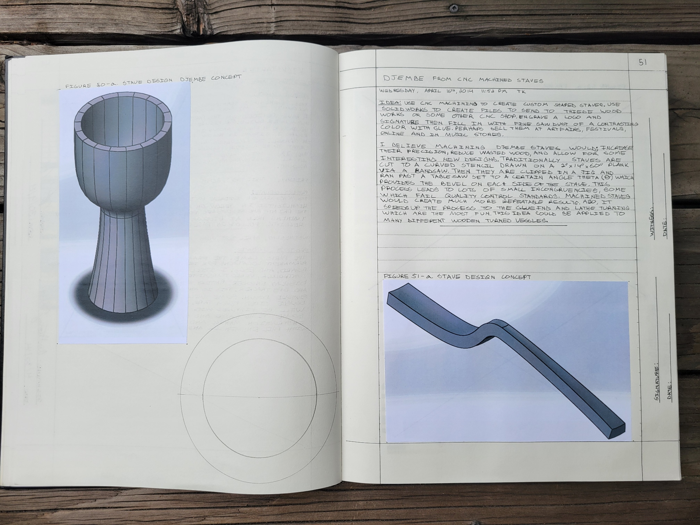
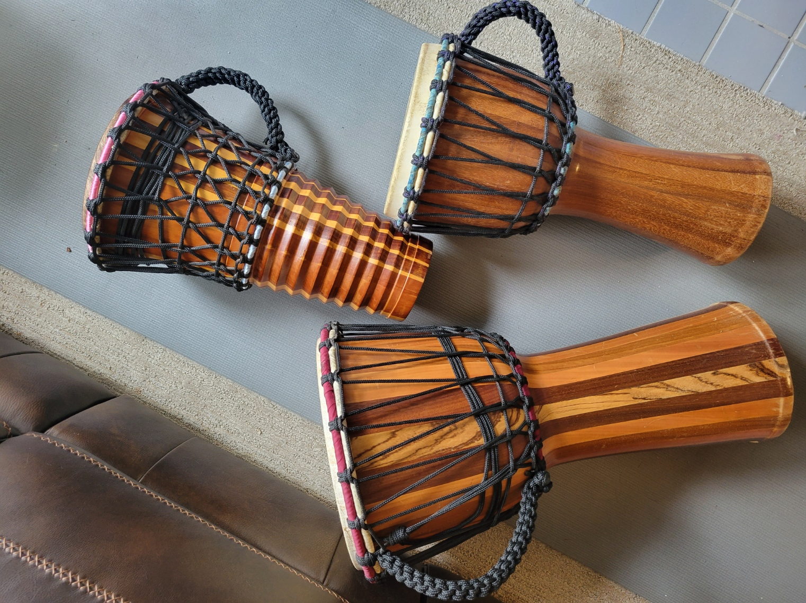

# Djembe — Engineering Documentation for a Stave-Built Drum

> *Stave-built djembes — a technique I learned at Morgan Drums (St. Paul, MN) in October 2008 and have been refining as both a craft and an engineering problem ever since.*


## What this is

Engineering documentation for the stave-built djembe — a drum that is traditionally **carved from a single piece of hardwood** but that I've been building from **stave construction** for 17+ years. This repository combines three threads:

1. **Acoustics research** I conducted in college on how djembe geometry produces its characteristic tone.
2. **CAD geometry** for the goblet-profile body and the curved stave shapes that approximate it.
3. **Jig design** for the cutting fixtures that make stave-built djembes reproducible — the new engineering contribution this repo is built around.

Sister project (and methodological ancestor) of [`ashiko-drum-workshop`](https://github.com/tonykoop/ashiko-drum-workshop).

## Background

The djembe is a goblet-shaped hand drum originating with the **Mande peoples of West Africa** — Mali, Guinea, Burkina Faso, Côte d'Ivoire, Senegal. Traditionally it is carved from a single piece of West African hardwood (lenge, djalla, dugura) with a goatskin head and rope tuning. Its sound profile is unusually wide for a hand drum: a deep bass tone from the open center, a sharp open tone from the rim, and a high slap tone played with the fingertips on the rim.

I started building drums professionally at **Morgan Drums**, a small family company in St. Paul, Minnesota, in **October 2008**. That tenure is signed and dated inside one of the djembes I built there:


Morgan Drums introduced me to the design choice this entire repository circles around: **building djembes from staves rather than carving them.** It's not the traditional method, and it's significantly harder to engineer correctly — but it lets you use locally-sourced North American hardwoods, cuts material waste dramatically, and produces a drum with a distinctively bright, articulate tone because the stave seams act as small acoustic discontinuities.

## The engineering challenge

A djembe has a **goblet profile** — a wide bowl at the head, a narrowing neck, and a flared foot. This is the engineering reason most djembes are carved rather than staved.

Compare it to an ashiko, which is essentially a truncated cone with a single constant taper angle. An ashiko stave is a straight, tapered piece of wood, and every stave in a drum has the same compound miter angle. **My ashiko workshop produced 16 drums with that single-angle approach** ([documentation](https://github.com/tonykoop/ashiko-drum-workshop)).

A djembe stave does not have that property. Because the body's diameter changes nonlinearly along its height — large at the bowl, small at the neck, large again at the foot — the **compound miter angle that makes adjacent staves meet flush also changes along the stave's height.** A stave that is correctly cut at the bowl will leave gaps at the neck. A stave that fits at the neck will overlap at the bowl.

There are roughly three ways around this problem:

- **Approach A — Segmented stack.** Build the drum as a stack of short staved "rings," each ring with its own constant compound angle. Glue the rings together vertically. This is essentially how segmented woodturning is done. It works, but the horizontal seams are visible and acoustically distinct.
- **Approach B — Curved staves.** Cut each stave as a *curved* piece from a thicker hardwood blank, so the stave's edge profile follows the body curve. This is geometrically what you want, but it's expensive in material and requires a cutting fixture that can produce a smooth curved profile reproducibly.
- **Approach C — Rough-cut and lathe-finish.** Stave-build a slightly oversized cylindrical or conical body, then lathe-turn the goblet profile into the outside surface. The stave seams are interior structural elements and the visible exterior is turned. This is the approach I built with at Morgan Drums.

The jig design work in this repository targets **approaches B and C** — the geometry is shared, and a fixture that can produce a curved-edge stave is the same kind of thing as a fixture that can guide a lathe gouge through a goblet profile.

## Acoustics research

> *(Forthcoming — to be added when I locate the college acoustics study from my undergrad years.)*

The college study examined the relationship between djembe shell geometry and the three-tone sound profile (bass / open / slap). Key questions covered:

- How does the bowl-to-neck diameter ratio affect bass tone fundamental frequency?
- How does shell wall thickness influence the spectrum — and is a stave-built shell with internal seams acoustically indistinguishable from a carved shell?
- What happens to the tone profile when the goatskin head tension is varied across its useful range?

The study informs the geometry choices in `/CAD/djembe-body/` — particularly the bowl diameter and neck-to-bowl ratio targeted by the jig designs.

## CAD and jig design

> *(Forthcoming — actively in progress.)*


*Page 51, Wednesday April 16, 2014: the original notebook entry where the CNC-machined-stave concept was sketched. Figure 60-a shows the full goblet-body concept; Figure 51-a shows a single-stave concept geometry. The text outlines the idea of using CNC to cut custom-shaped staves, fill seams with contrast sawdust + glue, and sell at art fairs and music stores — the seed of the jig design work this repo is built around.*

Repository structure is laid out for:

- `/CAD/djembe-body/` — the target goblet profile, both the Morgan Drums standard sizes (small, medium, large) and any new variants.
- `/CAD/stave/` — stave geometry derived from the target body, by approach (A: segmented rings, B: curved staves, C: rough cylindrical-pre-turning).
- `/CAD/jigs/` — the cutting fixtures. The two key ones I'm working toward:
  - **A curve-profile router jig** that can cut the inner and outer edge curve of a curved djembe stave reproducibly from a thicker blank.
  - **A variable-angle compound miter sled** for the table saw, where the angle indexes against position along the stave so the compound miter changes along the cut rather than staying constant.

Both will be CAD-modeled, drawing-exported, and (eventually) physically built and tested against a small batch of djembes.

## Build history

Two djembes from my Morgan Drums tenure are pictured at the bottom of the hero photo. Both are stave-built, finished with progressive lacquer coats, rope-tuned with 3/16" double-braided polyester, and headed with locally-sourced goatskin. Both are signed and dated inside the bowl.


*Three of my stave-built djembes side-by-side — different stave-wood combinations, each goblet body lathe-turned, rope-tuned with 3/16" double-braided polyester, and headed with locally-sourced goatskin. The visible vertical seams are the stave joints — a signature of stave construction versus carved-from-solid.*

Build photos from 2008–2013 may exist in personal archives but are not yet recovered. The current photo set in `/images/` documents the finished drums.

## What this work is for

Three audiences:

- **The acoustics question** is for me, and for anyone curious about why staved drums sound different from carved drums. The college research suggested they do; the engineering documentation here is the next step in pinning down why.
- **The jig designs** are for any drum builder who wants to replicate stave-built djembes without the carved-from-solid-hardwood material cost. The jigs lower the barrier from "Morgan Drums apprenticeship" to "weekend project."
- **The portfolio frame** — for engineers and recruiters reading my GitHub: this repository documents a 17-year continuing craft practice that informs how I think about manufacturing, fixturing, and design-for-reproducibility in my engineering work today. The ashiko workshop ([sister repo](https://github.com/tonykoop/ashiko-drum-workshop)) is the same skill-set applied to a process I scaled to eight other people.

## License

Released under [CC-BY 4.0](LICENSE) — use freely with attribution. The djembe design itself draws on traditional Mande craft; the stave-construction methodology, CAD, jig designs, and analysis in this repository are my own work, free to reuse and adapt with credit.

## Repository structure

```
djembe/
├── README.md                  ← you are here
├── LICENSE                    ← CC-BY 4.0
├── .gitignore
├── research/                  ← college acoustics study + references (forthcoming)
├── analysis/                  ← derived geometry + tone calculations (forthcoming)
├── CAD/
│   ├── djembe-body/           ← target goblet profiles
│   ├── stave/                 ← stave geometry, approaches A / B / C
│   └── jigs/                  ← curve-profile router jig + variable-angle sled
├── drawings/                  ← PDF exports of the jigs and key parts
├── images/                    ← drum portraits, signature shots, build photos
└── reference/                 ← any reference documents
```

## Status — current and forthcoming

| Section | Status |
|---|---|
| Repo description, license, gitignore | ✓ done |
| Hero photos | ✓ in progress (Tony photographing now) |
| College acoustics study | searching personal archives |
| CAD — djembe body geometry | not started |
| CAD — stave geometry | not started |
| CAD — jig designs | not started |
| Build photos from 2008–2013 | low probability of recovery |

A repository in motion, not a finished portfolio piece.
