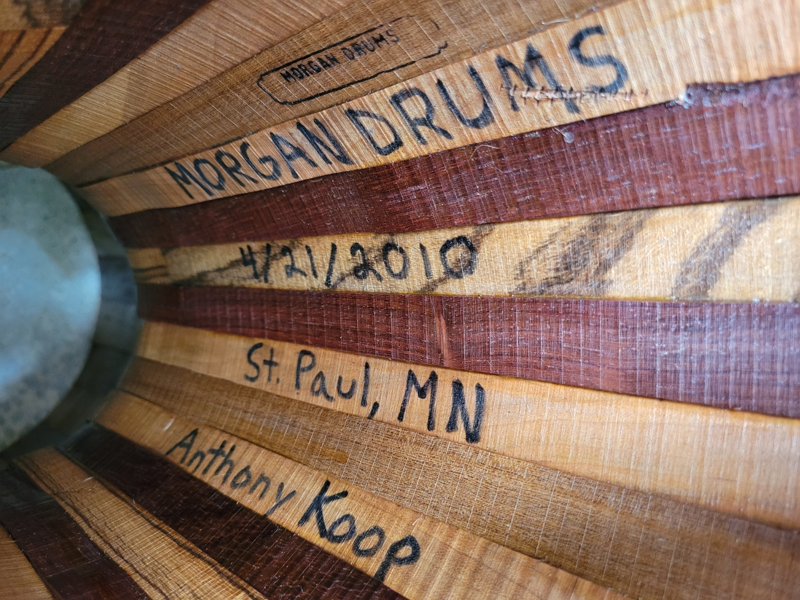
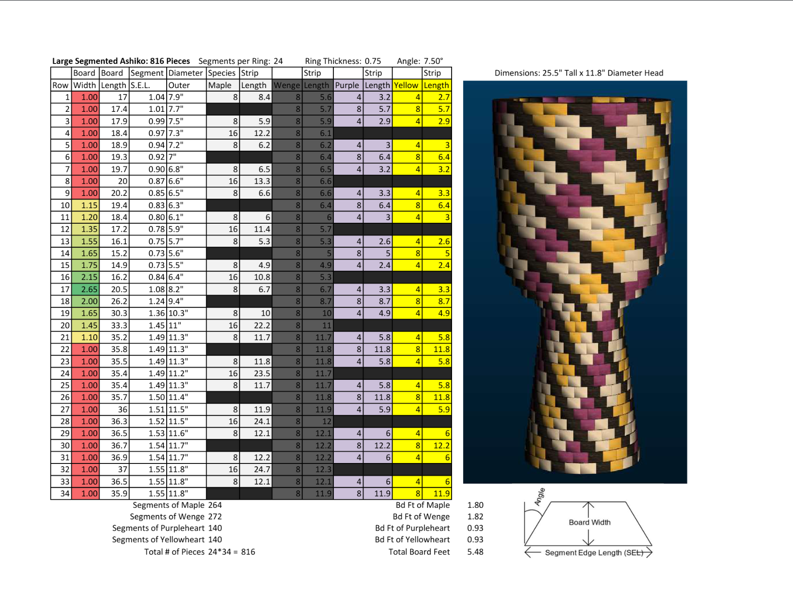
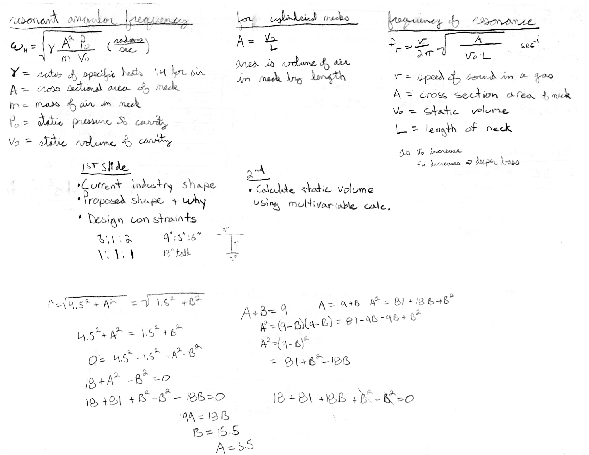
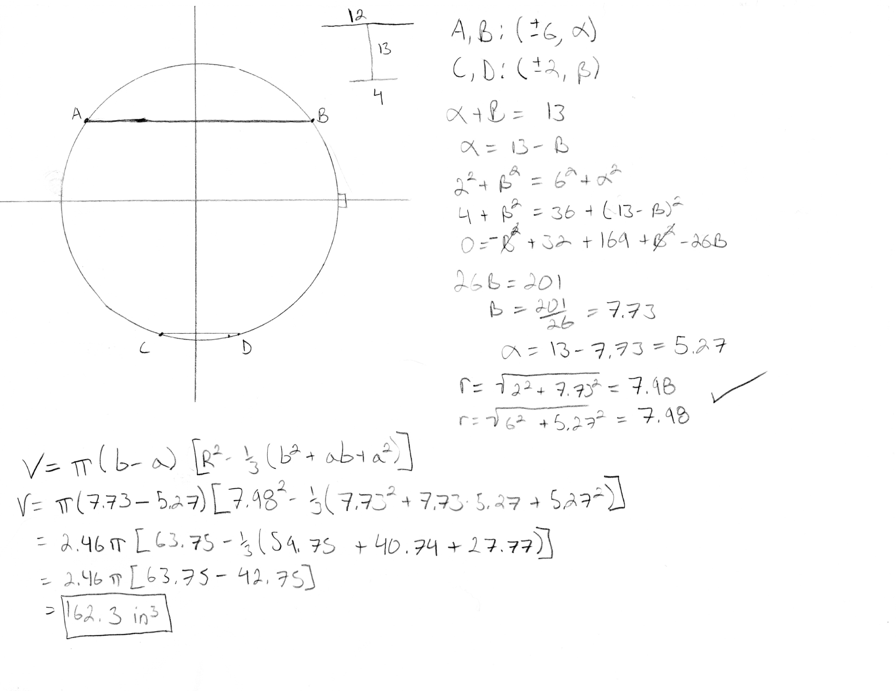
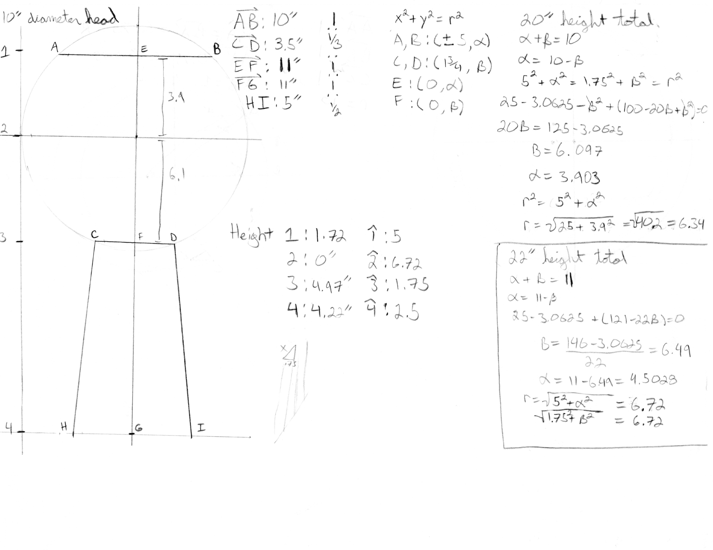

# Djembe — Engineering Documentation for a Stave-Built Drum

> *Stave-built djembes — a technique I learned at Morgan Drums (St. Paul, MN) in March 2010 and have been refining as both a craft and an engineering problem ever since.*


## What this is

Engineering documentation for the stave-built djembe — a drum that is traditionally **carved from a single piece of hardwood** but that I've been building from **stave construction** for 16+ years. This repository combines three threads:

1. **Acoustics research** I conducted in college on how djembe geometry produces its characteristic tone.
2. **CAD geometry** for the goblet-profile body and the curved stave shapes that approximate it.
3. **Jig design** for the cutting fixtures that make stave-built djembes reproducible — the new engineering contribution this repo is built around.

Sister project (and methodological ancestor) of [`ashiko-drum-workshop`](https://github.com/tonykoop/ashiko-drum-workshop).

## Background

The djembe is a goblet-shaped hand drum originating with the **Mande peoples of West Africa** — Mali, Guinea, Burkina Faso, Côte d'Ivoire, Senegal. Traditionally it is carved from a single piece of West African hardwood (lenge, djalla, dugura) with a goatskin head and rope tuning. Its sound profile is unusually wide for a hand drum: a deep bass tone from the open center, a sharp open tone from the rim, and a high slap tone played with the fingertips on the rim.

I started building drums professionally at **Morgan Drums**, a small family company in St. Paul, Minnesota, in **March 2010**. That early tenure is signed and dated inside one of the Morgan Drums djembes I worked on there:


*Signed inside the shell on **April 21, 2010** during my early Morgan Drums period. This one is a good provenance photo because it reflects work I did on the drum without implying I cut the original staves myself.*

Morgan Drums introduced me to the design choice this entire repository circles around: **building djembes from staves rather than carving them.** It's not the traditional method, and it's significantly harder to engineer correctly — but it lets you use locally-sourced North American hardwoods, cuts material waste dramatically, and produces a drum with a distinctively bright, articulate tone because the stave seams act as small acoustic discontinuities.

## The engineering challenge

A djembe has a **goblet profile** — a wide bowl at the head, a narrowing neck, and a flared foot. This is the engineering reason most djembes are carved rather than staved.

Compare it to an ashiko, which is essentially a truncated cone with a single constant taper angle. An ashiko stave is a straight, tapered piece of wood, and every stave in a drum has the same compound miter angle. **My ashiko workshop produced 16 drums with that single-angle approach** ([documentation](https://github.com/tonykoop/ashiko-drum-workshop)).

A djembe stave does not have that property. Because the body's diameter changes nonlinearly along its height — large at the bowl, small at the neck, large again at the foot — the **compound miter angle that makes adjacent staves meet flush also changes along the stave's height.** A stave that is correctly cut at the bowl will leave gaps at the neck. A stave that fits at the neck will overlap at the bowl.

There are roughly three ways around this problem:

- **Approach A — Segmented stack.** Build the drum as a stack of short staved "rings," each ring with its own constant compound angle. Glue the rings together vertically. This is essentially how segmented woodturning is done. It works, but the horizontal seams are visible and acoustically distinct.
- **Approach B — Curved staves.** Cut each stave as a *curved* piece from a thicker hardwood blank, so the stave's edge profile follows the body curve. This is geometrically what you want, but it's expensive in material and requires a cutting fixture that can produce a smooth curved profile reproducibly. This is the approach I built with at Morgan Drums.
- **Approach C — Rough-cut and lathe-finish.** Stave-build a slightly oversized cylindrical or conical body, then lathe-turn the goblet profile into the outside surface. The stave seams are interior structural elements and the visible exterior is turned. 

The jig design work in this repository targets **approaches B and C** — the geometry is shared, and a fixture that can produce a curved-edge stave is the same kind of thing as a fixture that can guide a lathe gouge through a goblet profile.


*Approach A worked out by hand: a **27-ring segmented-stack design** for a 10"×20" djembe, dated 9/8/2020. The two mirror-image profiles show the goblet outline approximated by a stack of horizontal rings — wide at the head (rings 1–8 ≈ 10.5" OD), narrowing through the neck (rings 13–22 ≈ 5–5.5" OD), then flaring back to the foot (rings 24–27 climbing back to ~8" OD). The right-hand column tabulates the per-ring spec — height (column A), thickness (column B), and outer diameter — so each ring becomes a constant-angle stave problem (the ashiko geometry, just at a different diameter for every ring) instead of a variable-angle one. The visible smooth-curve overlay on top of the stepped profile is the target goblet silhouette this stack approximates; the stair-step error is the inherent cost of Approach A and the reason Approaches B and C exist. **This drawing is the geometry behind the bullet point above** — proof that the segmented approach was worked out as a real design alternative before the jig design effort settled on the curved-stave / lathe-finish path.*

That segmented path is no longer just a note in the README: the recovered archive in [`CAD/Segmented Djembe/`](CAD/Segmented%20Djembe/) now focuses on the djembe-specific branch of that work, with large and small segmented djembe variants, rendered previews, and summary exports. The ashiko and conga-related files that were originally mixed into this folder have now been split back out into their sister repositories so each instrument keeps its own design history.


*A later segmented-study sheet: ring-by-ring dimensions and wood-species planning at left, concept rendering at right. Even though the segmented build path was not the final direction I settled on for stave-built djembes, this image shows the design problem being worked through seriously as a manufacturable alternative.*

## Acoustics research — bass-tone analysis (undergrad presentation)

In undergrad I presented an acoustics study modeling the djembe **bass tone** as a **Helmholtz resonator** — the air cavity inside the bowl, coupled to the open drumhead aperture, behaves like a spring-mass system whose resonant frequency sets the deep, low tone you hear when you strike the center of the head.

The fundamental result is the Helmholtz frequency:

$$f_H = \frac{v}{2\pi}\sqrt{\frac{A}{V_0 \cdot L_e}}$$

where *v* is the speed of sound (~13,500 in/s), *A* is the port (drumhead) area, *V₀* is the cavity volume, and *Lₑ* is the effective port length. For a djembe builder, the engineering question reduces to: **what does V₀ need to be to land on a target bass frequency?**

For this study I use a room-temperature air value for *v* because the djembe problem is a struck-membrane / room-air cavity problem. The [`didgeridoo`](https://github.com/tonykoop/didgeridoo) repo uses a warmer breath-temperature speed of sound intentionally, because it models a player-driven air column.


*The presentation outline (top-center): "1st slide: current industry shape · proposed shape & why · design constraints (3:1:2 = 9":3":6", 1:1:1, 10" tall) — 2nd: calculate static volume using multivariable calc." Top-left and top-right: the resonant-frequency formulas, derived in both angular form (`ωH = √(γAP₀/(mV₀))`) and the practical Helmholtz form. The annotation that ties the whole study together is in my own writing under the "frequency of resonance" block: **as V₀ increases, fH decreases ⇒ deeper bass.** That single sentence is the design rule the entire study supports — bigger bowl, lower bass.*

### The geometry problem behind the volume

Most of the eleven pages of working aren't acoustics — they're **geometry**. To get *V₀* for a real djembe profile, I had to:

1. Fit a circular arc through three measured points on the bowl's silhouette (head opening, widest point, neck).
2. Take that arc's surface of revolution about the drum axis.
3. Integrate over the bounded section to get the enclosed cavity volume.

The disk method gave me a closed form:

$$V_0 = \pi (b - a) \left[ R^2 - \tfrac{1}{3}(b^2 + ab + a^2) \right]$$

— and from there it was a matter of running numbers for the geometry I wanted.


*A clean single-page worked example. Top-left: three points (A,B at ±6, C,D at ±2) and the constraint that they all lie on a circle of unknown radius — the algebra in the top-right column solves the simultaneous equations, gives R = 7.98. Bottom: the volume integral evaluated symbolically and numerically to **V₀ = 162.3 in³** for that geometry.*

### Sweeping the design space

The fun part of having the model is that you can ask "what if?". I ran the calculation for both industry-standard and proposed shapes, and for variants in overall drum height. Small changes in profile produce predictable shifts in bass tone — exactly the design lever a builder wants:


*A two-case sweep: 20"-tall total → R = 6.34, and 22"-tall total → R = 6.72, with full point-coordinate setup at right (head, midpoint, neck and foot points). Sweeping overall height like this lets you trade off bass depth against ergonomics and material cost. The mini-elevation drawing on the left shows the actual djembe profile being measured.*

Across the geometries I computed, the predicted bass fundamental *fH* landed in the **~100–140 Hz** range, which sanity-checks against measured djembe bass tones (typically 80–120 Hz).

### Scope and what's next

This study modeled the **bass tone only** — the deep tone produced by air-cavity Helmholtz resonance. The **open** and **slap** tones a djembe player produces with rim strikes are governed by very different physics: **circular-membrane Bessel modes** on the goatskin head, set by head tension and head diameter, not by cavity volume. Those weren't part of this undergrad presentation; modeling them would be a separate study.

All eleven pages of the original handwritten working — including the false starts, an *"I isn't diameter! only part of top"* mid-derivation correction in the sphere-resonance section, and the comparison against [drums.org](https://drums.org)'s published Mande proportions — live in [`drawings/`](drawings/).

The study informs the geometry choices in `/CAD/djembe-body/` — particularly the bowl-volume target the jig designs will need to hit for a chosen bass tone.

### L3-frontier follow-up: full-cavity FEM

The lumped Helmholtz model treats the bowl above the neck as one cavity coupled through a zero-volume port. The goblet's foot section is dropped from the formula entirely — and the [`analysis/helmholtz-fem/`](analysis/helmholtz-fem/) study published alongside this README quantifies how much that omission costs. A pure-numpy 1D Webster's-horn FEM (verified against analytic uniform-tube modes to 0.5%) on the parametric goblet profile gives a fundamental that is **25–38% lower** than the lumped prediction across the three Morgan Drums sizes — well above the ~20% "the goblet effect is real" threshold from issue [#1](https://github.com/tonykoop/djembe/issues/1). See [`analysis/helmholtz-fem/results.md`](analysis/helmholtz-fem/results.md) and the deck at [`analysis/helmholtz-fem/capstone.md`](analysis/helmholtz-fem/capstone.md). Empirical (mic + FFT) validation is the L4 follow-on — explicitly deferred at this stage.

## CAD and jig design

> *(Forthcoming — actively in progress.)*


*Page 51, Wednesday April 16, 2014: the original notebook entry where the CNC-machined-stave concept was sketched. Figure 60-a shows the full goblet-body concept; Figure 51-a shows a single-stave concept geometry. The text outlines the idea of using CNC to cut custom-shaped staves, fill seams with contrast sawdust + glue, and sell at art fairs and music stores — the seed of the jig design work this repo is built around.*

Repository structure is laid out for:

- `/CAD/djembe-body/` — the target goblet profile, both the Morgan Drums standard sizes (small, medium, large) and any new variants.
- `/CAD/stave/` — stave geometry derived from the target body, by approach (A: segmented rings, B: curved staves, C: rough cylindrical-pre-turning).
- `/CAD/jigs/` — the cutting fixtures. The two key ones I'm working toward:
  - **A curve-profile router jig** that can cut the inner and outer edge curve of a curved djembe stave reproducibly from a thicker blank.
  - **A variable-angle compound miter sled** for the table saw, where the angle indexes against position along the stave so the compound miter changes along the cut rather than staying constant.

One historical archive is already present:

- `/CAD/Segmented Djembe/large-djembe/` — large segmented djembe pattern studies, spreadsheets, and exports
- `/CAD/Segmented Djembe/small-djembe/` — small segmented djembe pattern studies and previews
- `/CAD/Segmented Djembe/misc/` — summary and supporting archive material retained with the djembe branch

Both will be CAD-modeled, drawing-exported, and (eventually) physically built and tested against a small batch of djembes.

## Build history

Two djembes from my Morgan Drums tenure are pictured at the bottom of the hero photo. Both are stave-built, finished with progressive lacquer coats, rope-tuned with 3/16" double-braided polyester, and headed with locally-sourced goatskin. Both are signed and dated inside the bowl.


*Three of my stave-built djembes side-by-side — different stave-wood combinations, each goblet body lathe-turned, rope-tuned with 3/16" double-braided polyester, and headed with locally-sourced goatskin. The visible vertical seams are the stave joints — a signature of stave construction versus carved-from-solid.*

Build photos from 2008–2013 may exist in personal archives but are not yet recovered. The current photo set in `/images/` documents the finished drums.

## What this work is for

Three audiences:

- **The acoustics question** is for me, and for anyone curious about how djembe geometry sets its tone. The college research nailed down the bass tone via Helmholtz cavity resonance; the open follow-on questions — membrane modes for the open and slap tones, and whether staved versus carved shells differ acoustically at all — are the next steps.
- **The jig designs** are for any drum builder who wants to replicate stave-built djembes without the carved-from-solid-hardwood material cost. The jigs lower the barrier from "Morgan Drums apprenticeship" to "weekend project."
- **The portfolio frame** — for engineers and recruiters reading my GitHub: this repository documents a 17-year continuing craft practice that informs how I think about manufacturing, fixturing, and design-for-reproducibility in my engineering work today. The ashiko workshop ([sister repo](https://github.com/tonykoop/ashiko-drum-workshop)) is the same skill-set applied to a process I scaled to eight other people.

## License

Released under [CC-BY 4.0](LICENSE) — use freely with attribution. The djembe design itself draws on traditional Mande craft; the stave-construction methodology, CAD, jig designs, and analysis in this repository are my own work, free to reuse and adapt with credit.

## Repository structure

```
djembe/
├── README.md                  ← you are here
├── LICENSE                    ← CC-BY 4.0
├── .gitignore
├── research/                  ← college acoustics study + references (forthcoming)
├── analysis/                  ← derived geometry + tone calculations (forthcoming)
├── CAD/
│   ├── djembe-body/           ← target goblet profiles
│   ├── Segmented Djembe/      ← recovered segmented djembe archive
│   │   ├── large-djembe/      ← large segmented variants
│   │   ├── small-djembe/      ← small segmented variants
│   │   └── misc/              ← summary and supporting files
│   ├── stave/                 ← stave geometry, approaches A / B / C
│   └── jigs/                  ← curve-profile router jig + variable-angle sled
├── drawings/                  ← PDF exports of the jigs and key parts
├── images/                    ← drum portraits, signature shots, build photos
└── reference/                 ← any reference documents
```

## Status — current and forthcoming

| Section | Status |
|---|---|
| Repo description, license, gitignore | ✓ done |
| Hero photos | ✓ in progress (Tony photographing now) |
| College acoustics study (bass-tone Helmholtz analysis) | ✓ scanned in — 11 pages in `drawings/`, summarized in README |
| CAD — historical segmented design archive | ✓ recovered and organized in `CAD/Segmented Djembe/` |
| CAD — djembe body geometry | forthcoming |
| CAD — stave geometry | forthcoming |
| CAD — jig designs | not started |
| Build photos from 2008–2013 | low probability of recovery |

Living document — the historical build context, acoustics derivation, and segmented-archive branch are already in place; the main remaining work is CAD body/stave/jig publication.
