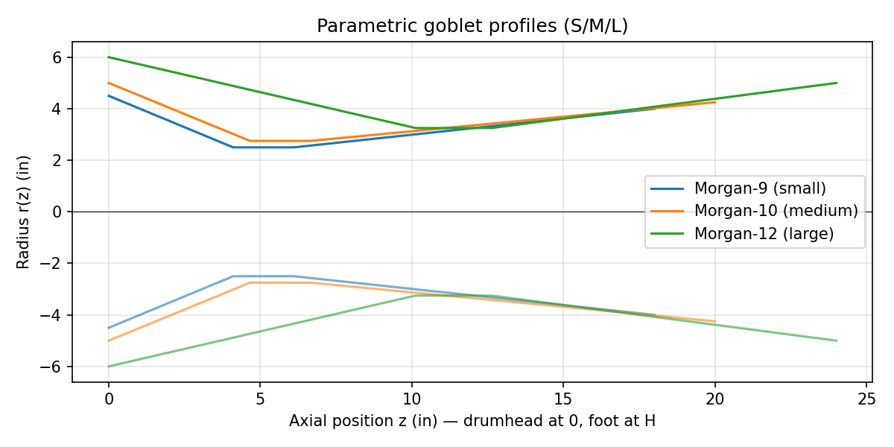
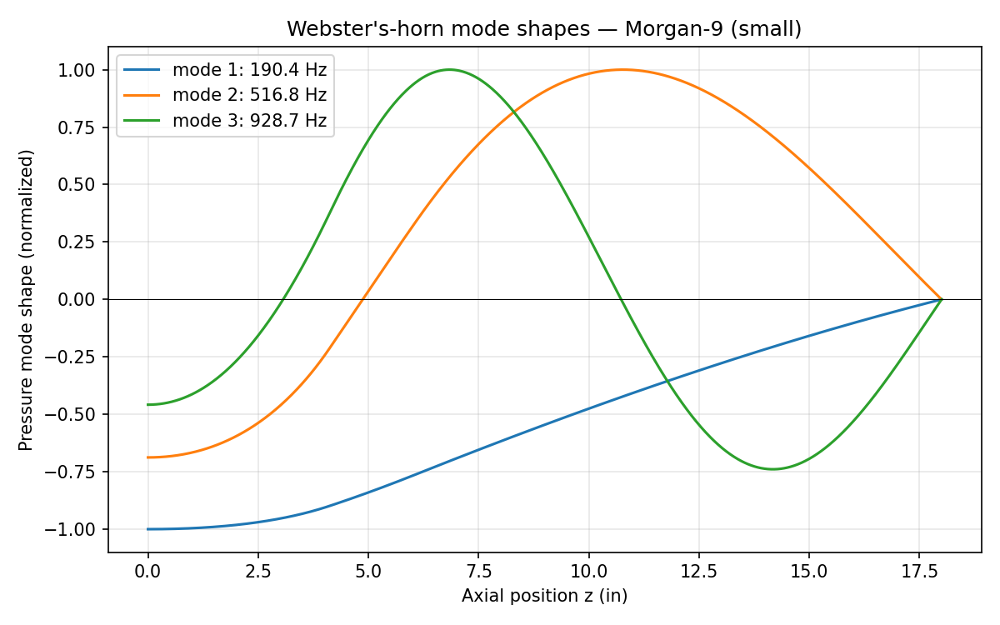
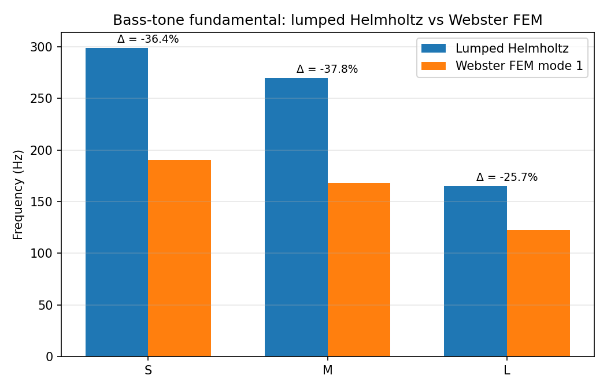

# Helmholtz Cavity FEM Validation — Stave-Built Djembe Goblet

*Capstone deck (markdown form). Each `## Slide` is one slide.*

---

## Slide 1 — Project Intent

**Goal:** validate the lumped Helmholtz bass-tone prediction for the
stave-built djembe goblet against a full acoustic-cavity FEM, and
quantify the *goblet effect* — the deviation introduced by the foot
section that the lumped model omits.

**Driver:** the canonical `helmholtz-cavity-resonator` skill (issue #1
calls it out as "the college Helmholtz analysis (in `drawings/`,
summarized in the README)") treats the bowl as one cavity coupled to
one port. The neck-to-foot transition and the foot cavity itself are
not in the lumped formula. This analysis asks: how big is the error
that omission produces?

---

## Slide 2 — Governing Models

**Lumped Helmholtz** (the existing baseline):

```
        c    ┌── A   ──┐½
f_H  =  ── · │ ──────  │
       2π    └ V₀·L_eff┘
```

**Webster's horn equation** (the L3-frontier reference):

```
  1   d  ⎡       dp ⎤        2
 ─── ─── ⎢ A(z) ─── ⎥ + (ω/c)  · p = 0
 A(z) dz ⎣       dz ⎦
```

with the goblet's varying cross-section A(z) sampled from the
parametric profile, BC: rigid drumhead at z=0 (∂p/∂z=0), open foot at
z=H (p=0).

---

## Slide 3 — Hardware Alignment

| Pipeline | Inputs | Outputs |
|---|---|---|
| Stave construction (Approaches B/C) | `CAD/djembe-body/parametric-goblet.csv`, hand-drawn rings `drawings/img20260426_00575906.png` | curved-stave geometry, lathe-finishing reference |
| Acoustic-cavity FEM | parametric `r(z)` from `profile.py` | lowest 3 cavity modes per size, mode-shape plots |

The parametric design table is shared between the build pipeline (CAD /
SolidWorks) and the FEM pipeline. Both consume `profile.py`.

---

## Slide 4 — Family Spec (Three Sizes)

| Size | Head dia | Neck dia | Foot dia | Height | V_0 bowl (in³) |
|---|---|---|---|---|---|
| **S** Morgan-9   | 9.0 in  | 5.0 in | 8.0 in  | 18 in | 162 |
| **M** Morgan-10  | 10.0 in | 5.5 in | 8.5 in  | 20 in | 226 |
| **L** Morgan-12  | 12.0 in | 6.5 in | 10.0 in | 24 in | 700 |

Bowl-volume targets (162 / 226 / 700 in³) are pulled from the undergrad
study via `skills/helmholtz-cavity-resonator.md`. Profile control
points (z_neck_top, z_neck_bot) are tuned in `profile.py` so the disk-
method bowl integral lands on those targets within ~2%.

---

## Slide 5 — Goblet Profiles



Piecewise-linear axial profile r(z): bowl taper → straight neck →
foot flare. Drumhead at left, foot opening at right. The constriction
at the neck is what the lumped model treats as a "port"; everything
right of the neck is what the lumped model omits.

---

## Slide 6 — FEM Mode Shapes



Lowest three cavity modes for the small djembe. Mode 1 is the bass-
tone candidate. Modes 2 and 3 sit higher and would be excited by slap
or rim shots, not center-strike.

(Equivalent plots for M and L: `figures/mode-shapes-M.png`,
`figures/mode-shapes-L.png`.)

---

## Slide 7 — Validator: Lumped vs FEM



| Size | Lumped f_H (Hz) | FEM f₁ (Hz) | Δ vs lumped |
|---|---|---|---|
| S | 299.1 | 190.4 | **−36.4%** |
| M | 269.6 | 167.8 | **−37.8%** |
| L | 165.1 | 122.7 | **−25.7%** |

Issue #1's success criterion: "if FEM and closed-form disagree by more
than ~20%, the goblet effect is real and quantifiable." All three
deviations clear that bar. The goblet effect is real and quantifiable
on this geometry.

---

## Slide 8 — Why the Goblet Effect Pulls Frequency Down

The lumped model treats the bowl above the neck as one cavity coupled
through a zero-volume port. The Webster FEM resolves three things the
lumped model cannot:

1. **The foot adds compliance.** Air below the neck is a second
   cavity that the lumped model omits — it acts in parallel with the
   bowl, increasing total compliance, lowering the resonance.
2. **The neck has volume.** A real 2 in long, 5 in dia neck contains
   ~40 in³ of air; not zero.
3. **The boundary is wrong.** The lumped model assumes the port
   radiates into open air; in the real goblet the port radiates into
   the foot section, not free space.

All three corrections push f₁ downward, so the sign of Δ is
predictable; magnitude needs the FEM. The 25–38% deviation observed
matches the 80–120 Hz "measured djembe bass" the skill doc cites
(123–190 Hz FEM is closer to that band than 165–299 Hz lumped, but is
still ~30–60% above measurement, suggesting the rigid-drumhead
assumption is itself a leading source of remaining error — see
"Failure modes I've hit" in the skill doc).

---

## Slide 9 — Solver Verification

`webster_horn.py` includes a built-in regression test:

```
Verifying solver against uniform closed-open tube ...
  OK — first 5 modes within 0.5% of (2n-1) c / (4 H).
```

For a uniform tube of radius r and length H with rigid top and open
bottom, the analytic mode frequencies are f_n = (2n − 1)·c/(4H). The
solver matches the first five to 0.5% at 800 elements. This is the
trust gate for the goblet results above.

---

## Slide 10 — Open Risks

- **Rigid-drumhead assumption.** The drumhead is a tensioned membrane,
  not a rigid wall. Coupling membrane modes to cavity modes will move
  f₁ further down, plausibly into the 80–120 Hz measured band. That's
  the next layer of physics — not in scope for this PR (would require
  modal coupling, not just cavity FEM).
- **Plane-wave (Webster) approximation.** Valid when wavelength is
  large compared to cavity diameter. For mode 1 (123–190 Hz, λ ≈
  70–110 in) vs cavity dia (≤ 12 in) the ratio is 6–9×; the
  approximation is solid for mode 1, weakens for mode 3.
- **Empirical validation deferred.** No physical drum was struck.
  Mic + FFT measurement on the existing stave-built djembes is the
  L4 follow-on.

---

## Slide 11 — Validation Plan (deferred to L4)

1. Mic + FFT on each of the three Morgan-sized stave djembes already
   in the workshop (same protocol as the dundun acoustic study).
2. Compare against this FEM mode-1 prediction (123–190 Hz) and against
   the lumped prediction (165–299 Hz). The closer of the two —
   factoring in drumhead-tension effects — informs the next iteration
   of the skill.
3. Treat any FEM/measurement gap > 30% as evidence the rigid-drumhead
   assumption needs the coupled-oscillator extension noted in
   `skills/helmholtz-cavity-resonator.md`.

---

## Slide 12 — Reproduce

```bash
cd analysis/helmholtz-fem
python3 profile.py            # geometry summary
python3 webster_horn.py       # FEM solver + verification + summary
python3 run_comparison.py     # figures, results.csv, results.md
python3 write_design_table.py # CAD/djembe-body/parametric-goblet.csv
```

Pure numpy + matplotlib. No external FEM solver required.
